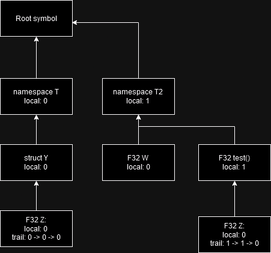

# Parser / Symbol tree

To keep track of symbols, a tree has to be created that contains all symbols.



Represents the following code:

```C
namespace T {
    struct Y {
        F32 Z;
    };
}

namespace T2 {
    static const F32 W = 1;
    F32 test() {
        F32 Z = 123;
        return z;
    }
}
```

To represent this without wasting too much space on symbols, we support four different formats to represent a symbol trail as a U32. This is called a **SymbolId**:

```C
U2 formatId;	//Indicates which format is to be used.

//2-layer format, for namespaces with classes or functions of classes.
//Level 1 of (1 << 10) - 1 (all 1s) indicates we don't have a 2nd level.
U20 level0; U10 level1;

//3-layer format such as members of structs in namespaces.
U14 level0; U10 level1; U6 level2;

//3-layer format, generally for class members in namespaces
U10 levels[3];

//4 to 5 layer format, weird stuff such as nested templates.
//Max value in level4 (0xF) means no level 4.
U8 level0; U8 level1; U5 level2; U5 level3; U4 level4;
```

Each symbol is append only, so the parent symbol will create a new symbol at the end and that will be the local id. All other symbols next to it are moved by a spot and thus the global id (into the symbol array) isn't stable but can be calculated by traversing the symbol map.